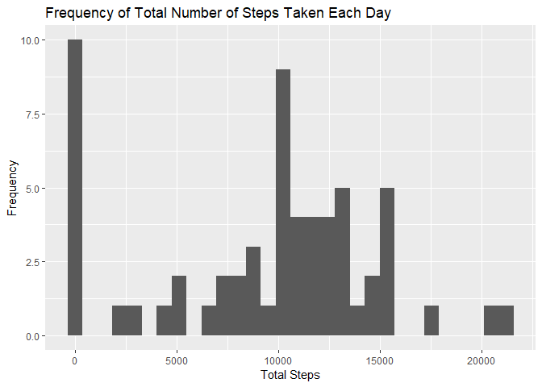
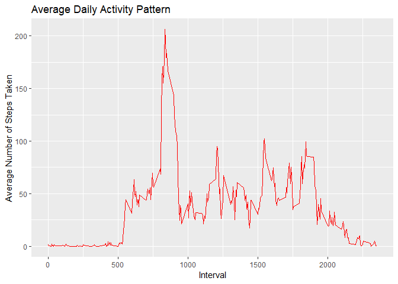
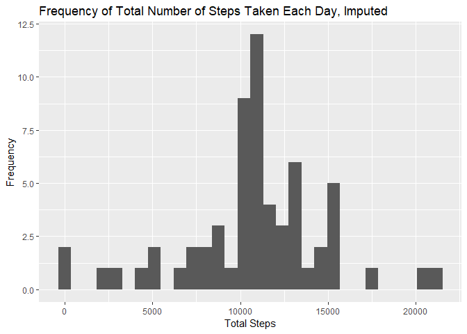
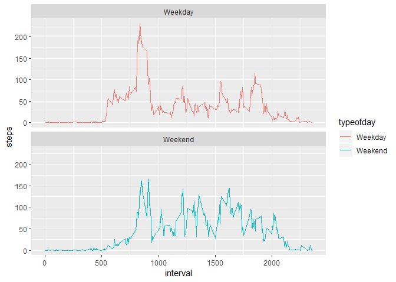

## Loading and preprocessing the data
### Loading the Data


```r
library(dplyr)
```

```
## Warning: package 'dplyr' was built under R version 3.5.3
```

```
## 
## Attaching package: 'dplyr'
```

```
## The following objects are masked from 'package:stats':
## 
##     filter, lag
```

```
## The following objects are masked from 'package:base':
## 
##     intersect, setdiff, setequal, union
```

```r
library(ggplot2)
```

```
## Warning: package 'ggplot2' was built under R version 3.5.3
```

```r
library(lubridate)
```

```
## 
## Attaching package: 'lubridate'
```

```
## The following object is masked from 'package:base':
## 
##     date
```

```r
main<-read.csv("activity.csv")
```

### Preprocessing the Data


```r
colnames(main)
```

```
## [1] "steps"    "date"     "interval"
```

```r
summary(main)
```

```
##      steps                date          interval     
##  Min.   :  0.00   2012-10-01:  288   Min.   :   0.0  
##  1st Qu.:  0.00   2012-10-02:  288   1st Qu.: 588.8  
##  Median :  0.00   2012-10-03:  288   Median :1177.5  
##  Mean   : 37.38   2012-10-04:  288   Mean   :1177.5  
##  3rd Qu.: 12.00   2012-10-05:  288   3rd Qu.:1766.2  
##  Max.   :806.00   2012-10-06:  288   Max.   :2355.0  
##  NA's   :2304     (Other)   :15840
```

```r
main$days<-weekdays(as.Date(main$date))
```


## What is mean total number of steps taken per day?
For this part of the assignment, you can ignore the missing values in the dataset.

### 1. Calculate the total number of steps taken per day


```r
total_steps<-aggregate(main$steps,by=list(main$date),FUN=sum,na.rm=TRUE)
colnames(total_steps)<-c("Date","TotalSteps")
total_steps
```

```
##          Date TotalSteps
## 1  2012-10-01          0
## 2  2012-10-02        126
## 3  2012-10-03      11352
## 4  2012-10-04      12116
## 5  2012-10-05      13294
## 6  2012-10-06      15420
## 7  2012-10-07      11015
## 8  2012-10-08          0
## 9  2012-10-09      12811
## 10 2012-10-10       9900
## 11 2012-10-11      10304
## 12 2012-10-12      17382
## 13 2012-10-13      12426
## 14 2012-10-14      15098
## 15 2012-10-15      10139
## 16 2012-10-16      15084
## 17 2012-10-17      13452
## 18 2012-10-18      10056
## 19 2012-10-19      11829
## 20 2012-10-20      10395
## 21 2012-10-21       8821
## 22 2012-10-22      13460
## 23 2012-10-23       8918
## 24 2012-10-24       8355
## 25 2012-10-25       2492
## 26 2012-10-26       6778
## 27 2012-10-27      10119
## 28 2012-10-28      11458
## 29 2012-10-29       5018
## 30 2012-10-30       9819
## 31 2012-10-31      15414
## 32 2012-11-01          0
## 33 2012-11-02      10600
## 34 2012-11-03      10571
## 35 2012-11-04          0
## 36 2012-11-05      10439
## 37 2012-11-06       8334
## 38 2012-11-07      12883
## 39 2012-11-08       3219
## 40 2012-11-09          0
## 41 2012-11-10          0
## 42 2012-11-11      12608
## 43 2012-11-12      10765
## 44 2012-11-13       7336
## 45 2012-11-14          0
## 46 2012-11-15         41
## 47 2012-11-16       5441
## 48 2012-11-17      14339
## 49 2012-11-18      15110
## 50 2012-11-19       8841
## 51 2012-11-20       4472
## 52 2012-11-21      12787
## 53 2012-11-22      20427
## 54 2012-11-23      21194
## 55 2012-11-24      14478
## 56 2012-11-25      11834
## 57 2012-11-26      11162
## 58 2012-11-27      13646
## 59 2012-11-28      10183
## 60 2012-11-29       7047
## 61 2012-11-30          0
```

### 2. Make a histogram of the total number of steps taken each day. 


```r
a<-ggplot(total_steps, aes(TotalSteps))
a+geom_histogram()+xlab("Total Steps")+ylab("Frequency")+ggtitle("Frequency of Total Number of Steps Taken Each Day")
```

```
## `stat_bin()` using `bins = 30`. Pick better value with `binwidth`.
```

<!-- -->

### 3. Calculate and report the mean and median of the total number of steps taken per day


```r
meanorig<-mean(total_steps$TotalSteps)
meanorig
```

```
## [1] 9354.23
```


```r
medianorig<-median(total_steps$TotalSteps)
medianorig
```

```
## [1] 10395
```

## What is the average daily activity pattern?

### 1. Make a time series plot (i.e. \color{red}{\verb|type = "l"|}type="l") of the 5-minute interval (x-axis) and the average number of steps taken, averaged across all days (y-axis)


```r
daily<-aggregate(main$steps,by=list(main$interval),FUN=mean,na.rm=TRUE)
colnames(daily)<-c("Interval","AverageSteps")
b<-ggplot(daily,aes(Interval,AverageSteps))
b+geom_line(color="red")+ylab("Average Number of Steps Taken")+xlab("Interval")+ggtitle("Average Daily Activity Pattern")
```

<!-- -->

### 2. Which 5-minute interval, on average across all the days in the dataset, contains the maximum number of steps?


```r
daily[which.max(daily$AverageSteps),1]
```

```
## [1] 835
```

## Imputing missing values
Note that there are a number of days/intervals where there are missing values (coded as \color{red}{\verb|NA|}NA). The presence of missing days may introduce bias into some calculations or summaries of the data.

### 1. Calculate and report the total number of missing values in the dataset (i.e. the total number of rows with \color{red}{\verb|NA|}NAs)


```r
main$Missing<-is.na(main$steps)
Missing<-sum(main$Missing)
Missing
```

```
## [1] 2304
```

### 2. Devise a strategy for filling in all of the missing values in the dataset. The strategy does not need to be sophisticated. For example, you could use the mean/median for that day, or the mean for that 5-minute interval, etc.

The method used for filling in all of the missing values in the dataset is to use the mean for that 5-minute interval as shown in the code below.


```r
for (i in 1:nrow(main)){
      ifelse(main[i,5]==TRUE,main[i,1]<-daily[match(main[i,3],daily[,1]),2],main[i,1]<-main[i,1])
}
```

Create a new dataset that is equal to the original dataset but with the missing data filled in.

The earlier code already filled in the missing data, and the following code merely creates another dataset.


```r
main_imputed<-main
```

### 3. Make a histogram of the total number of steps taken each day and Calculate and report the mean and median total number of steps taken per day. Do these values differ from the estimates from the first part of the assignment? What is the impact of imputing missing data on the estimates of the total daily number of steps?

It can be seen in the histogram below on the total Number of Steps taken each day for the imputed data has shifted from the original histogram wherein a lot of the values were at 0 steps per day. It can be expected that the mean and median would shift upward with this update, and we will explore that below.


```r
total_steps_imputed<-aggregate(main$steps,by=list(main$date),FUN=sum,na.rm=TRUE)
colnames(total_steps_imputed)<-c("Date","TotalSteps")
c<-ggplot(total_steps_imputed, aes(TotalSteps))
c+geom_histogram()+xlab("Total Steps")+ylab("Frequency")+ggtitle("Frequency of Total Number of Steps Taken Each Day, Imputed")
```

```
## `stat_bin()` using `bins = 30`. Pick better value with `binwidth`.
```

<!-- -->

As mentioned earlier, it can be seen that the mean and median have increased from the original values. There was a greater effect on the mean than the median.


```r
mean(total_steps_imputed$TotalSteps)-meanorig
```

```
## [1] 1411.959
```


```r
median(total_steps_imputed$TotalSteps)-medianorig
```

```
## [1] 371.1887
```

## Are there differences in activity patterns between weekdays and weekends?
For this part the \color{red}{\verb|weekdays()|}weekdays() function may be of some help here. Use the dataset with the filled-in missing values for this part.

Create a new factor variable in the dataset with two levels - "weekday" and "weekend" indicating whether a given date is a weekday or weekend day.


```r
main_imputed$typeofday<-wday(as.Date(main_imputed$date))
main_imputed$typeofday<-ifelse(main_imputed$typeofday==1|main_imputed$typeofday==7,"Weekend","Weekday")
```

Make a panel plot containing a time series plot (i.e. \color{red}{\verb|type = "l"|}type="l") of the 5-minute interval (x-axis) and the average number of steps taken, averaged across all weekday days or weekend days (y-axis). See the README file in the GitHub repository to see an example of what this plot should look like using simulated data.


```r
final<-aggregate(steps~interval+typeofday,main_imputed,mean)
d<-ggplot(final, aes(y=steps,x=interval,color=typeofday))
d+geom_line()+facet_wrap(~typeofday,ncol=1,nrow=2)
```

<!-- -->
